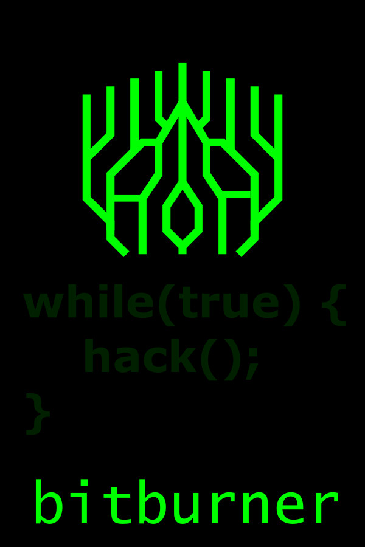

<!-- Improved compatibility of back to top link: See: https://github.com/othneildrew/Best-README-Template/pull/73 -->

<!--
*** Thanks for checking out the Best-README-Template. If you have a suggestion
*** that would make this better, please fork the repo and create a pull request
*** or simply open an issue with the tag "enhancement".
*** Don't forget to give the project a star!
*** Thanks again! Now go create something AMAZING! :D
-->

 

---

<!-- PROJECT LOGO -->
 

<h3 align="center">BitBurnerRoot</h3>

  

    A place for all my code while playing the steam game <a href="https://store.steampowered.com/app/1812820/Bitburner">Bitburner</a>.
     
    <a href="https://github.com/github_username/repo_name/issues">Report Bug</a>
    ·
    <a href="https://github.com/github_username/repo_name/issues">Request Feature</a>
  

---

<!-- ABOUT THE PROJECT -->
## About The Project

Built using the [Official Bitburner Typescript Template](https://github.com/bitburner-official/typescript-template)

<!-- GETTING STARTED -->
## Getting Started

1. Install Packages
    - `npm i`
2. Run typescript compiler
    - `npm run transpile`
    - Will watch for file changes and output js files to dist
3. Open another terminal, run bitburner remote-api server
    - `npm run watch`
4. Connect to remote API in game
    - `Bitburner -> Options -> Remote API -> Connect`

## Todo

1. Continuous batching
    - Currently batching only occurs in the first `hacktime` duration, then stops as we can't start jobs reliably while others are completing

See the [open issues](https://github.com/github_username/repo_name/issues) for a full list of proposed features (and known issues).

(<a href="#readme-top">back to top</a>)

